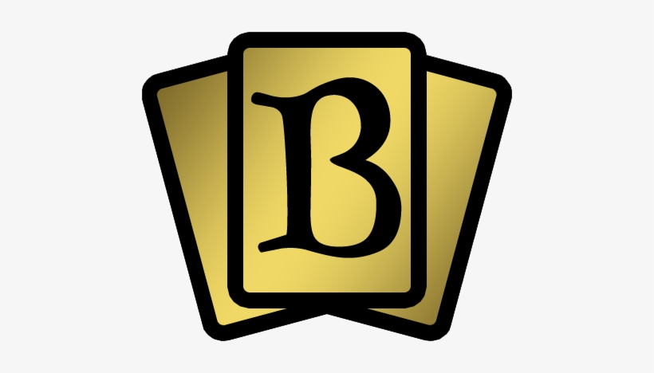

**ONLY DOWNLOAD IT HERE, DO NOT TRUST OTHER PLACES.**

Este es el repositorio oficial del proyecto MagicDB

Escrito por: Ridel Saavedra Flores - GitHub: [@shakarr](https://github.com/shakarr) Cristian León Mendez - GitHub: [@crislemen](https://github.com/)

**DISCLAIMER:** Esto es un proyecto realizado con fines didácticos, no somos proprietarios de ninguna de las imagenes relacionadas con el universo de [Magic The Gathering](https://magic.wizards.com/es)

Por favor lea la LICENCIA para mas información respecto a MagicDB

# Características

- Permite la inserción de cartas 
- Puede filtrar por una carta en concreto, buscando por diferentes patrones
- Las cartas estarán conectadas a una base de datos por lo que estarán ctualizadas
- A través de la aplicación se podrá gestionar la base de datos

# Expansiones disponibles

|Expansiones|Cartas|Año|Símbolo|Disponibilidad|
|:---|:---:|:---|:---|:---|
|Alpha|295|1993||YES|
|Beta|295|1993||NO|
|Unlimited|295|1993||NO|
|Revised|302|1994||NO|
|Cuarta Edición|378|1995||NO|
|Quinta Edición|449|1997||NO|
|Sexta Edición|350|1999||NO|
|Séptima Edición|350|2001||NO|
|Octava Edición|350|2003||NO|
|Novena Edición|350|2005||NO|

# Tested on

- 
- 
- 

# Requisitos

- Java
- SO de preferencia(Windows, Linux, Mac)
- Sistema gestor de base de datos
